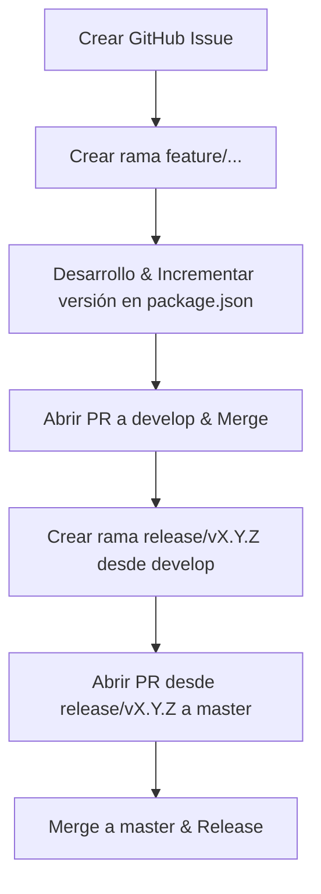

# Flujo de Trabajo con GitHub Issues y Releases

Este documento define la metodología para documentar, planificar, versionar y publicar cambios en `portfolio-manager` utilizando GitHub Issues, la convención SemVer y ramas `release/`.

---

## 🎯 Objetivos

1. **Trazabilidad**: Vincular cada cambio de código con una razón o requerimiento documentado.
2. **Control de Versiones Limpio (SemVer)**: Garantizar que la versión en `package.json` se actualice en la característica.
3. **Flujo Seguro de Despliegue a Producción (`master`)**: Garantizar que solo se haga PR a `master` desde ramas dedicadas `release/<version>`.

---

## 📋 Plantillas de Issues Disponibles

Al crear un nuevo issue en GitHub, se debe seleccionar la plantilla adecuada:

- 🚀 **Nueva Funcionalidad (`[FEATURE]`)**: Para nuevas características o mejoras solicitadas por usuarios.
- 🐛 **Reporte de Bug (`[BUG]`)**: Para fallos, comportamientos inesperados o problemas de rendimiento.
- 📝 **Propuesta de Cambio / Tarea Técnica (`[TASK]`)**: Para refactorizaciones, cambios de infraestructura o actualización de dependencias.

---

## 🔄 Ciclo de Vida del Cambio y Publicación

### 1. Creación del Issue y Rama

- Antes de comenzar un cambio, se crea o asigna el GitHub Issue.
- Se trabaja en ramas `feature/<nombre>`, `fix/<nombre>` o `refactor/<nombre>`.

### 2. Actualización de Versión en `package.json`

- Durante el desarrollo en la rama `feature/` (o antes de la PR a `develop`), se incrementa la versión en `package.json` (ej. de `3.0.0` a `3.1.0`).

### 3. PR y Merge a `develop`

- Se abre la PR desde la rama `feature/` hacia `develop` incluyendo `Closes #123`.
- Al mergear en `develop`, GitHub cierra automáticamente el issue.

### 4. Creación de la Rama Release y PR a `master`

- Con los cambios y la versión consolidada en `develop`, se crea la rama `release/<version>` (ej. `release/3.1.0`).
- Se abre la Pull Request **desde `release/3.1.0` hacia `master`**.

---

## 🤖 Guía para Asistentes de IA (AGENTS)

Cuando trabajes con asistentes de IA (Antigravity/Gemini/Jules):

1. **Incremento de Versión**: Asegúrate de que se actualice `package.json` en la rama del cambio.
2. **Commits Estructurados**: Referenciar `Closes #<número_issue>` o `Ref #<número_issue>`.
3. **Flujo de PRs**: Hacer PR a `develop` desde la `feature/`, y únicamente abrir PR a `master` desde una rama `release/<version>`.
