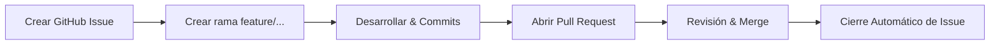

# Flujo de Trabajo con GitHub Issues (Issue-Driven Development)

Este documento define la metodología para documentar, planificar y rastrear cambios en `portfolio-manager` utilizando GitHub Issues.

---

## 🎯 Objetivos

1. **Trazabilidad**: Vincular cada cambio de código con una razón o requerimiento documentado.
2. **Historial Limpio**: Mantener la motivación de los cambios accesible para cualquier colaborador o asistente IA.
3. **Automatización**: Permitir el cierre automático de tareas e integración con sistemas de CI/CD y changelogs.

---

## 📋 Plantillas de Issues Disponibles

Al crear un nuevo issue en GitHub, se debe seleccionar la plantilla adecuada:

- 🚀 **Nueva Funcionalidad (`[FEATURE]`)**: Para nuevas características o mejoras solicitadas por usuarios.
- 🐛 **Reporte de Bug (`[BUG]`)**: Para fallos, comportamientos inesperados o problemas de rendimiento.
- 📝 **Propuesta de Cambio / Tarea Técnica (`[TASK]`)**: Para refactorizaciones, cambios de infraestructura o actualización de dependencias.

---

## 🔄 Ciclo de Vida del Cambio

### 1. Creación del Issue
Antes de comenzar un cambio significativo, se crea o consulta el GitHub Issue correspondiente.

### 2. Creación de la Rama
Las ramas deben seguir la convención:
- `feature/<nombre-breve-o-numero-issue>`
- `fix/<nombre-breve-o-numero-issue>`
- `refactor/<nombre-breve-o-numero-issue>`

*Ejemplo:* `feature/github-issues-workflow` o `fix/issue-12-auth-error`.

### 3. Vinculación en Commits y PRs
En las descripciones de los Pull Requests o en el mensaje final de merge/commit, incluye palabras clave de cierre de GitHub:

- `Closes #123`
- `Fixes #123`
- `Resolves #123`

Esto provocará que al hacer merge a `develop` o `main`, GitHub cierre el issue automáticamente y cree la vinculación visual.

---

## 🤖 Guía para Asistentes de IA (AGENTS)

Cuando trabajes con asistentes de IA (Antigravity/Gemini/Jules):
1. **Pide referencia al Issue**: Proporciona el número de issue o pide a la IA que redacte la propuesta/solución teniendo en cuenta el issue.
2. **Commits estructurados**: Indica al agente que incluya `Closes #<número_issue>` o `Ref #<número_issue>` en el mensaje de commit.
